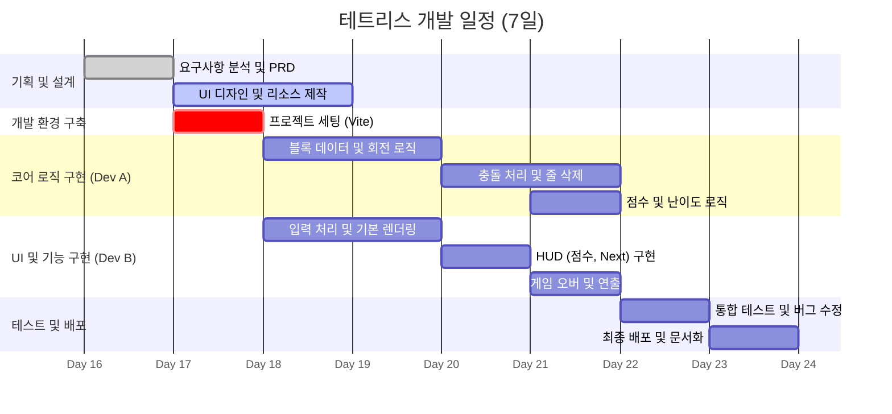

# 테트리스 게임 프로젝트 WBS (Work Breakdown Structure)

## 1. 프로젝트 개요
*   **목표**: 웹 브라우저 기반 테트리스 게임 개발
*   **기간**: 7일 (Day 1 ~ Day 7)
*   **인력 구성**:
    *   **설계자 (Designer)**: 1명 (기획, 디자인, 문서화)
    *   **개발자 1 (Dev A)**: 1명 (메인 로직, 코어 알고리즘)
    *   **개발자 2 (Dev B)**: 1명 (UI/UX 구현, 입출력 처리)

## 2. 간트 차트 (Gantt Chart)

## 3. 상세 작업 목록 (Checklist)

### Day 1: 착수 및 환경 설정
| ID | 작업명 (Task) | 담당자 | 상태 | 비고 |
| :--- | :--- | :--- | :--- | :--- |
| 1.1 | **기술 스택 검증 및 프로젝트 생성** | Dev A | [ ] | Vite + Vanilla JS 설정 |
| 1.2 | **Git 저장소 초기화 및 규칙 수립** | Dev All | [ ] | 커밋 규칙 정립 |
| 1.3 | UI/UX 컨셉 디자인 (컬러, 레이아웃) | Designer | [ ] | 블록 색상, 배경 등 |
| 1.4 | 기본 폴더 구조 생성 | Dev A | [x] | 완료됨 |

### Day 2~3: 핵심 기능 개발 (Core Implementation)
| ID | 작업명 (Task) | 담당자 | 상태 | 비고 |
| :--- | :--- | :--- | :--- | :--- |
| 2.1 | 7종 테트로미노 데이터 모델링 | Dev A | [ ] | 좌표계 및 회전 상수 정의 |
| 2.2 | Canvas 렌더링 루프 구현 | Dev B | [ ] | `requestAnimationFrame` |
| 2.3 | **키보드 이벤트 핸들러 구현** | Dev B | [ ] | 이동, 회전, 드롭 |
| 2.4 | 보드 그리드(10x20) 상태 관리 로직 | Dev A | [ ] | 2차원 배열 활용 |

### Day 4: 게임 로직 고도화
| ID | 작업명 (Task) | 담당자 | 상태 | 비고 |
| :--- | :--- | :--- | :--- | :--- |
| 3.1 | **충돌 감지 (Collision Detection)** | Dev A | [ ] | 핵심 난이도 상 |
| 3.2 | 줄 삭제 및 블록 하강 로직 | Dev A | [ ] | |
| 3.3 | 점수 계산 및 레벨 시스템 | Dev A | [ ] | |
| 3.4 | 정보 표시 영역 (HUD) 디자인 적용 | Dev B | [ ] | |
| 3.5 | 다음 블록 (Next Block) 미리보기 | Dev B | [ ] | |

### Day 5: 연출 및 폴리싱
| ID | 작업명 (Task) | 담당자 | 상태 | 비고 |
| :--- | :--- | :--- | :--- | :--- |
| 4.1 | 게임 오버 / 일시정지 팝업 구현 | Dev B | [ ] | |
| 4.2 | 애니메이션 효과 (줄 삭제, 하드 드롭) | Designer/Dev B | [ ] | 시각적 피드백 |
| 4.3 | 사운드 효과음 적용 (Optional) | Designer | [ ] | 무료 에셋 활용 |

### Day 6: 테스트 (QA)
| ID | 작업명 (Task) | 담당자 | 상태 | 비고 |
| :--- | :--- | :--- | :--- | :--- |
| 5.1 | 기능별 단위 테스트 | Dev All | [ ] | 코너 케이스 확인 |
| 5.2 | **브라우저 호환성 테스트** | Designer | [ ] | Chrome, Edge 등 |
| 5.3 | 버그 수정 (Bug Fixes) | Dev All | [ ] | |

### Day 7: 배포 및 문서화
| ID | 작업명 (Task) | 담당자 | 상태 | 비고 |
| :--- | :--- | :--- | :--- | :--- |
| 6.1 | 최종 빌드 (Build) | Dev A | [ ] | `npm run build` |
| 6.2 | 사용자 매뉴얼 작성 | Designer | [ ] | `manual/` 폴더 |
| 6.3 | 프로젝트 회고 및 정리 | All | [ ] | |
